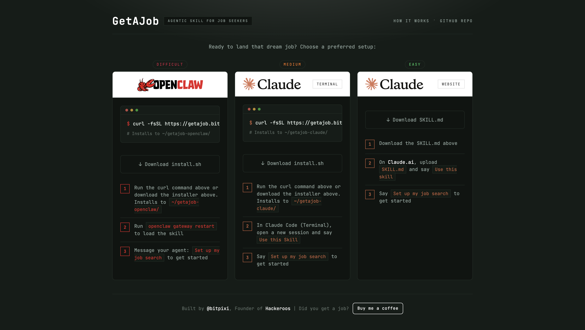

# GetAJob

AI-assisted job search skill for OpenClaw and Claude. GetAJob helps to speed up your job search, build your dream companies list, hunt for existing listings in your preferences, and drafts your outreach.

[Live site](https://getajob.bitpixi.com)



## Project Structure

```
getajob-site/
├── public/
│   ├── index.html
│   ├── openclaw/
│   │   ├── install.sh
│   │   ├── getajob-openclaw.zip
│   │   └── skill/
│   │       └── SKILL.md
│   └── claude/
│       ├── install.sh
│       ├── getajob-claude.zip
│       └── skill/
│           ├── SKILL.md
│           ├── scripts/
│           └── references/
└── README.md
```

## Install

OpenClaw:
```bash
curl -fsSL https://getajob.bitpixi.com/openclaw/install.sh | bash
```

Claude:
```bash
curl -fsSL https://getajob.bitpixi.com/claude/install.sh | bash
```

## 30-Day Update

Within 30 days, this skill was responsible for getting me a software engineering interview with a major bank, documented here: [A Lovely Day](https://phosphor.bitpixi.com/2026-03-11-lovely-day.html). It was not successful, but it also helped me land a decent contract gig.

[Watch the video](https://phosphor.bitpixi.com/2026-03-11-lovely-day.mp4)

Part 2 is soon, because we are still seeking.

## What's Next?

Version 2 will introduce automation for online job application forms.

Support the project: [Buy me a coffee](https://buymeacoffee.com/hackeroos)
